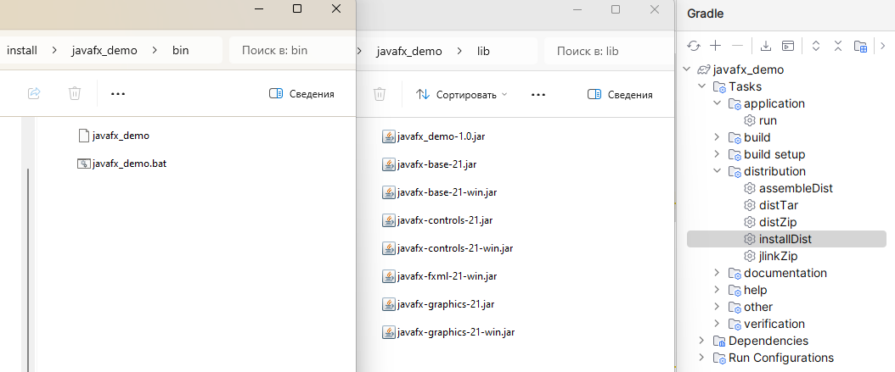
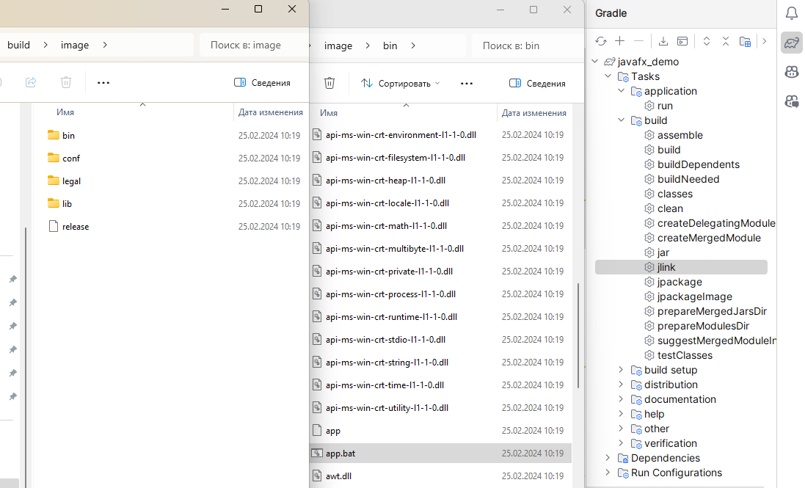

# JAVAFX_DEMO_2024
**Пример программы с JavaFX на Java для IntelliJ IDEA, со сборщиком Gradle**

## Опции Gradle для сборки проекта:

***Создание готовой программы для запуска под системным JDK/JRE (installDist):***

***Создание портативного автономного образа программы с JRE (jlink):***

***Создание портативного автономного образа программы с JRE и файлом запуска типа EXE (jpackageImage):***

